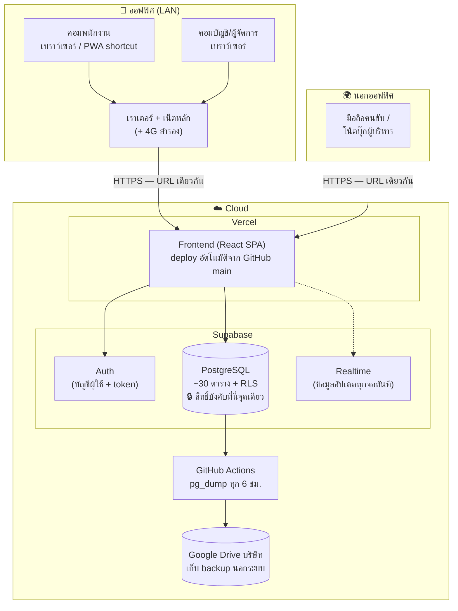
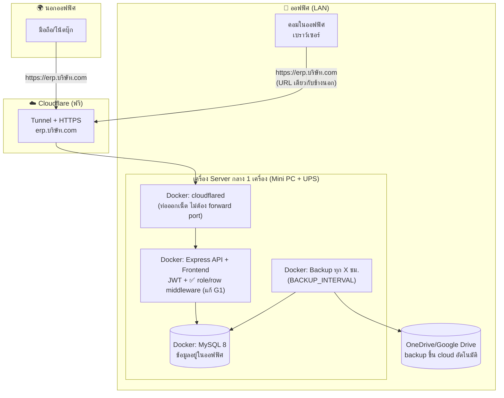

# ข้อเสนอสถาปัตยกรรมระบบ LAN + Cloud แบบไร้รอยต่อ — KPS Transportation ERP

> เอกสารข้อเสนอ (Proposal) — จัดทำ 2 กรกฎาคม 2026
> ครอบคลุม: การเปรียบเทียบสถาปัตยกรรม 3 ทางเลือก · การวิเคราะห์สิทธิ์จาก PR #21 / PR #24 · แผนแก้ระบบ Desktop เดิม · แนวทาง Low-Maintenance · แผนผังระบบ · งบประมาณ · แผนดำเนินงานและ UAT

---

## 0. บทสรุปผู้บริหาร (Executive Summary)

**ข้อแนะนำหลัก: เลือก Option C (Web-based บน Cloud) เป็นระบบหลัก โดยใช้ระบบที่มีอยู่แล้ว (Vercel + Supabase) — เพราะระบบปัจจุบัน "เป็น Web-based อยู่แล้ว" ไม่ต้อง Re-platform ใหม่** และเก็บงานใน PR #21 (Self-hosted MySQL) ไว้เป็น **แผนสำรอง/ทางเลือก On-premise** สำหรับกรณีต้องการเก็บข้อมูลไว้ในออฟฟิศเอง

เหตุผลโดยย่อ:

1. **ระบบจริงวันนี้คือ Web App** (React + Vite) ที่ deploy บน Vercel และใช้ Supabase (PostgreSQL + Auth + RLS + Realtime) เป็นฐานข้อมูลกลาง — ผู้ใช้ใน LAN และนอกออฟฟิศเข้าผ่านเบราว์เซอร์ **URL เดียวกัน สิทธิ์ชุดเดียวกัน** อยู่แล้วโดยธรรมชาติ
2. **ปัญหา "Desktop ใช้ไม่ได้"** สืบเนื่องจากชุดติดตั้ง Self-hosted ใน PR #21 ที่**ยังไม่เคยถูกทดสอบกับ MySQL engine จริง** (ระบุไว้ในตัว PR เอง) — ไม่ใช่ปัญหาของระบบ Cloud ที่ใช้งานอยู่ ดูการวินิจฉัยในหัวข้อ 4
3. **Option A (Remote Desktop/Terminal Server) ไม่คุ้ม** สำหรับระบบนี้ เพราะเหมาะกับโปรแกรม Desktop เก่า (เช่น Express บัญชี) ที่แก้โค้ดไม่ได้ — แต่ KPS ERP เป็นเว็บที่เปิดจากเบราว์เซอร์ได้ทุกที่อยู่แล้ว จ่ายค่า Windows VPS + RDS CAL เพิ่มโดยไม่ได้อะไรกลับมา
4. สิ่งที่ต้องทำจริงคือ **อุดช่องว่างด้านสิทธิ์ 3 จุด** ที่พบจากการวิเคราะห์ PR #21/PR #24 (หัวข้อ 3.4) และ**ทำระบบสำรองข้อมูลอัตโนมัติ + ขั้นตอนปฏิบัติงานให้เป็นมาตรฐาน** (หัวข้อ 5)

| | Option A: Remote Desktop | Option B: Hybrid DB | **Option C: Web on Cloud (แนะนำ)** |
|---|---|---|---|
| คะแนนถ่วงน้ำหนัก (เต็ม 5) | 2.55 | 3.30 | **4.55** |
| Setup Cost | ~35,000–60,000 ฿ | ~40,000–80,000 ฿ | **~0–15,000 ฿** |
| ค่าใช้จ่าย/เดือน | ~2,500–5,500 ฿ | ~900–2,000 ฿ | **0–1,700 ฿** |
| ระยะเวลาถึง UAT | 3–4 สัปดาห์ | 6–10 สัปดาห์ | **2–4 สัปดาห์** |

---

## 1. สถานะระบบปัจจุบัน (As-Is)

ก่อนเปรียบเทียบทางเลือก ต้องเข้าใจก่อนว่าระบบมี "2 ร่าง" อยู่ในโค้ดเดียวกัน:

### 1.1 ร่างหลัก — Cloud (ใช้งานจริงอยู่ทุกวัน)

- **Frontend:** React 19 + Vite (SPA) — deploy อัตโนมัติบน **Vercel** ทุกครั้งที่ merge เข้า `main`
- **Backend:** **Supabase** ทำหน้าที่ครบวงจร — PostgreSQL (41 migrations, ~30 ตาราง), Authentication (email/username + password), **Row Level Security (RLS)** บังคับสิทธิ์ที่ระดับฐานข้อมูล, Realtime (ข้อมูลอัปเดตข้ามเครื่องทันที)
- **การเข้าถึง:** เบราว์เซอร์ → HTTPS → ใช้ได้ทั้งใน LAN และนอกออฟฟิศ ไม่ต้องติดตั้งอะไรที่เครื่องผู้ใช้

### 1.2 ร่างสำรอง — Self-hosted MySQL (PR #21, ยังเป็น Draft ไม่ได้ merge)

- Express API + Prisma + MySQL 8 + socket.io (realtime) + JWT auth — แพ็กเป็น **Docker Compose** (MySQL + API + ตัว backup อัตโนมัติ + Cloudflare Tunnel เสริม)
- เลือก backend ตอน build ด้วย `VITE_DATA_BACKEND` (`supabase` = ค่าเริ่มต้น / `mysql`)
- มีสคริปต์ย้ายข้อมูล + ย้ายผู้ใช้พร้อม bcrypt hash จาก Supabase (ผู้ใช้ล็อกอินด้วยรหัสเดิมได้)
- **สถานะ:** โค้ดครบแต่ **ยังไม่เคยรันกับ MySQL จริง** — เป็นต้นตอที่น่าจะเป็นไปได้มากที่สุดของปัญหา "Desktop ใช้ไม่ได้" (หัวข้อ 4)

### 1.3 ซากเก่าที่ควรเก็บกวาด

- `server/prisma/schema.prisma` (SQLite) + seed รหัสผ่าน hardcode — dead code จากยุคแรก
- `docs/auth-database-overview.md` — เนื้อหาบางส่วนล้าสมัยแล้ว (เขียนตอนยังใช้ localStorage; ปัจจุบัน frontend ต่อ Supabase จริงและ `BYPASS_AUTH = false` แล้ว)

---

## 2. เปรียบเทียบสถาปัตยกรรม 3 ทางเลือก

### 2.1 นิยามแต่ละทางเลือก (ปรับให้ตรงบริบท KPS)

**Option A — Remote Desktop / Terminal Server**
ตั้ง Windows VPS (หรือเซิร์ฟเวอร์ในออฟฟิศ) แล้วให้ทุกคน Remote Desktop เข้าไปเปิดโปรแกรมจากจุดเดียว ผู้ใช้นอกออฟฟิศต่อผ่าน VPN/RDP Gateway
*หมายเหตุ:* วิธีนี้เป็น "ยาสามัญ" สำหรับโปรแกรม Desktop เก่าที่แก้โค้ดไม่ได้ (เช่น Express บัญชี) — ถ้าในอนาคต KPS มีโปรแกรม Express บัญชีที่ต้องใช้ร่วมกันหลายคน วิธีนี้ (หรือบริการ Express on Cloud สำเร็จรูป) เหมาะกับ**โปรแกรมนั้น** แต่ไม่จำเป็นสำหรับ ERP ตัวนี้ซึ่งเป็นเว็บอยู่แล้ว

**Option B — Hybrid Database**
ฐานข้อมูลอยู่บน Cloud แต่ตัวโปรแกรมเป็น Desktop app ติดตั้งที่เครื่องใน LAN แล้วยิง API/Secure connection ขึ้นไป (ในทางปฏิบัติกับ codebase นี้ = ห่อเว็บด้วย Electron/Tauri หรือใช้โหมด MySQL ของ PR #21 โดยย้าย MySQL ขึ้น Cloud)

**Option C — Web-based บน Cloud (สถาปัตยกรรมปัจจุบัน ทำให้แข็งแรงขึ้น)**
ใช้ Vercel + Supabase ที่มีอยู่เป็นระบบหลัก ทุกคนใช้ผ่านเบราว์เซอร์ URL เดียว — งานที่เพิ่มคืออุดช่องว่างสิทธิ์, ทำ backup อัตโนมัติภายนอก Supabase, custom domain, และมาตรฐานการปล่อยเวอร์ชัน

### 2.2 ตารางเปรียบเทียบถ่วงน้ำหนัก

เกณฑ์และน้ำหนักตั้งจากโจทย์ของ KPS (เสถียร + ไม่ต้องตามแก้ยิบย่อย + สิทธิ์คงเดิมทุกช่องทาง):

| เกณฑ์ | น้ำหนัก | A: Remote Desktop | B: Hybrid DB | C: Web on Cloud |
|---|---:|---:|---:|---:|
| ความเสถียร / โอกาสเกิดปัญหายิบย่อย | 25% | 3 | 3 | 5 |
| ภาระ Maintenance ฝั่งเครื่องผู้ใช้ | 20% | 2 | 2 | 5 |
| สิทธิ์คงเดิมทั้ง LAN และนอกออฟฟิศ | 20% | 3 | 4 | 5 |
| ค่าใช้จ่ายรวม 3 ปี | 15% | 2 | 3 | 4 |
| ความเร็ว/ประสบการณ์ใช้งานใน LAN | 10% | 3 | 4 | 4 |
| ความเร็วในการขึ้นระบบ (Time to UAT) | 10% | 3 | 2 | 5 |
| **คะแนนรวม (เต็ม 5)** | 100% | **2.55** | **3.30** | **4.55** |

### 2.3 ข้อดี–ข้อเสียโดยละเอียด

#### Option A — Remote Desktop / Terminal Server

| ข้อดี | ข้อเสีย |
|---|---|
| โปรแกรมและข้อมูลอยู่จุดเดียว อัปเดตครั้งเดียวจบ | **ซ้ำซ้อน**: KPS ERP เป็นเว็บอยู่แล้ว การ RDP เข้าไปเปิดเบราว์เซอร์บน VPS คือจ่ายเงินเพื่อได้สิ่งที่มีอยู่ฟรี |
| จบปัญหาโปรแกรม Desktop เก่า (Express ฯลฯ) ได้จริง | ค่า license แพง: Windows Server + RDS CAL ~4,000–5,500 ฿/ผู้ใช้ (จ่ายครั้งเดียว) หรือเช่ารายเดือน |
| ควบคุม/สำรองข้อมูลศูนย์กลางง่าย | ประสบการณ์ใช้งานผ่าน RDP บนมือถือ/เน็ตช้า แย่กว่าเว็บมาก |
| | มี Single Point of Failure ที่ VPS + ต้องดูแล Windows patching เอง |
| | สิทธิ์ในแอปคงเดิม แต่เพิ่มชั้นบัญชี Windows/VPN ให้ดูแลอีกชุด |

**เหมาะเมื่อ:** มีโปรแกรม Desktop เก่าที่เลิกใช้ไม่ได้ (ถ้ามี Express บัญชี แนะนำพิจารณา "Express on Cloud" สำเร็จรูปของผู้ให้บริการไทย ~800–1,500 ฿/ผู้ใช้/เดือน แทนการตั้ง VPS เอง — จ้างเขาดูแล ไม่ต้องมี IT ประจำ)

#### Option B — Hybrid Database (DB บน Cloud + โปรแกรม Desktop ใน LAN)

| ข้อดี | ข้อเสีย |
|---|---|
| ข้อมูลรวมศูนย์บน Cloud — LAN และนอกออฟฟิศเห็นข้อมูลชุดเดียวกัน | **ต้องกลับไปดูแลโปรแกรมรายเครื่อง** — ติดตั้ง/อัปเดต Desktop app ทุกเครื่อง ขัดกับโจทย์ Low-Maintenance ตรง ๆ |
| ใช้งานใน LAN รู้สึก "เป็นโปรแกรม" มี icon เปิดเร็ว | ต้องสร้างและดูแล installer + auto-update pipeline เพิ่ม (งานใหม่ทั้งชุด) |
| ต่อยอดจากโหมด MySQL ของ PR #21 ได้บางส่วน | โหมด MySQL ของ PR #21 **ยังไม่มีการบังคับสิทธิ์ระดับแถวฝั่ง server** (ดู 3.4) — ต้องเขียนเพิ่มก่อนใช้จริง |
| | เวลาเน็ตออฟฟิศล่ม โปรแกรมใช้ไม่ได้อยู่ดี (DB อยู่ Cloud) — ไม่ได้เสถียรกว่าเว็บ |

**เหมาะเมื่อ:** ต้องการฟีเจอร์ที่เบราว์เซอร์ทำไม่ได้ (ต่อเครื่องชั่ง, เครื่องพิมพ์เฉพาะทาง, ทำงาน offline) — ปัจจุบัน KPS ยังไม่มีความต้องการเหล่านี้

#### Option C — Web-based บน Cloud (แนะนำ)

| ข้อดี | ข้อเสีย |
|---|---|
| **ไม่ต้อง Re-platform — ระบบเป็นแบบนี้อยู่แล้ว** ลงทุนเพิ่มเกือบศูนย์ | ต้องมีอินเทอร์เน็ต (บรรเทาได้: เน็ตสำรอง 4G/5G router ~600 ฿/เดือน) |
| อัปเดตจุดเดียว: merge → Vercel deploy → ทุกคนได้เวอร์ชันใหม่ทันทีที่ refresh | ข้อมูลอยู่กับผู้ให้บริการ Cloud (บรรเทาได้: backup อัตโนมัติออกมาเก็บเอง — หัวข้อ 5.2) |
| สิทธิ์บังคับที่ฐานข้อมูล (RLS) — **LAN หรือนอกออฟฟิศได้สิทธิ์เดียวกันโดยพิสูจน์ได้** เพราะเป็น server ตัวเดียวกัน | ค่าบริการรายเดือนเมื่อโตเกิน Free tier (Supabase Pro $25/เดือน) |
| ไม่มีอะไรให้ดูแลที่เครื่องผู้ใช้เลย — แค่เบราว์เซอร์ | Vendor lock-in ระดับหนึ่ง (บรรเทาได้: PR #21 คือเส้นทางอพยพสำเร็จรูป + backup เป็น SQL มาตรฐาน) |
| Supabase มี backup รายวัน + จุดกู้คืน (Pro) ให้ในตัว | |

### 2.4 ค่าใช้จ่ายเปรียบเทียบ (ประมาณการ, บาท)

> อัตราแลกเปลี่ยนประมาณ 36 ฿/USD · ตัวเลขเป็นช่วงประมาณการ ควรขอใบเสนอราคาจริงก่อนตัดสินใจ

| รายการ | A: Remote Desktop | B: Hybrid DB | C: Web on Cloud |
|---|---|---|---|
| **Setup (ครั้งเดียว)** | | | |
| เซิร์ฟเวอร์/VPS + ติดตั้งระบบ | 10,000–15,000 | 5,000–10,000 | 0 (มีอยู่แล้ว) |
| License (RDS CAL ~10 ผู้ใช้) | 40,000–55,000 | – | – |
| พัฒนา installer/auto-update + สิทธิ์ฝั่ง server | – | 30,000–70,000 (หรือแรงงานภายใน 3–6 สัปดาห์) | – |
| งานอุดช่องว่างสิทธิ์ + backup + domain (หัวข้อ 3.4, 5) | – | รวมข้างบน | 0–15,000 (หรือแรงงานภายใน 1–2 สัปดาห์) |
| **รวม Setup** | **~50,000–70,000** | **~35,000–80,000** | **~0–15,000** |
| **รายเดือน** | | | |
| VPS Windows (4 vCPU/16GB สำหรับ RDP หลายคน) | 2,500–5,000 | – | – |
| Database Cloud (Supabase Pro / Managed MySQL) | – | 900–1,800 | 0 (Free) → 900 (Pro เมื่อโต) |
| Hosting frontend (Vercel) | – | – | 0 (Hobby) → 720 (Pro ถ้าจำเป็น) |
| Domain (~400 ฿/ปี) | 35 | 35 | 35 |
| เน็ตสำรอง 4G (แนะนำทุก option) | 600 | 600 | 600 |
| **รวม/เดือน** | **~3,100–5,600** | **~1,500–2,400** | **~35–2,300** |
| **รวม 3 ปี (Setup + 36 เดือน)** | **~160,000–270,000** | **~90,000–165,000** | **~1,300–98,000** |

---

## 3. การวิเคราะห์สิทธิ์และการเข้าถึงข้อมูล (ศึกษาจาก PR #21 และ PR #24)

### 3.1 ความหมายของ PR #21 / PR #24 ในระบบนี้

- **PR #21** — *"Self-hosted MySQL deployment (LAN / desktop / online) alongside Supabase"* (สถานะ: Draft, ยังไม่ merge) — กลไกเชื่อมต่อ/สิทธิ์ฝั่ง self-hosted: JWT auth, whitelist ตาราง, socket.io realtime, Cloudflare Tunnel
- **PR #24** — *"ทะเบียนรถ + วางบิลก่อนปิดรอบ + วันที่ขึ้น/ลง + กระดานติดตามรับเงิน"* (merged 2 ก.ค. 2026) — เพิ่มหน้าจอ/ข้อมูลด้านการเงิน (`dispatch.billing`, `billing_notes.paid_at`, `load_date`/`unload_date`) ซึ่งเป็นข้อมูลอ่อนไหวที่สิทธิ์ต้องรัดกุม

### 3.2 แผนที่สิทธิ์ปัจจุบัน — 3 ระดับ

ระบบมี 4 บทบาท: `SUPER_ADMIN` / `ADMIN` / `MANAGER` / `EMPLOYEE` (คนขับ) เก็บใน `user_profiles.role` ผูกกับ `auth.users`

#### ระดับที่ 1 — สิทธิ์ระดับหน้าจอ (Screen level) — `src/lib/permissions.ts`

| กลุ่มหน้าจอ | ADMIN | MANAGER | EMPLOYEE (คนขับ) |
|---|:---:|:---:|:---:|
| Dashboard, การเงิน/ปิดงวด, ข้อมูลพนักงาน | ✅ | ✅ | ❌ |
| รายงานน้ำมัน/ขนส่ง/รถรายเดือน, ราคาน้ำมัน | ✅ | ✅ | ❌ |
| **วางบิล/ติดตามรับเงิน (`dispatch.billing` — จาก PR #24)** | ✅ | ✅ | ❌ |
| งานขนส่งประจำวัน, คีย์น้ำมัน, ยาง, ซ่อมบำรุง | ✅ | ✅ | ✅ (เห็นเฉพาะงานตน, ซ่อนคอลัมน์เงิน) |
| ตั้งค่าระบบ, จัดการผู้ใช้/รีเซ็ตข้อมูล (admin) | ✅ | ❌ | ❌ |

#### ระดับที่ 2 — สิทธิ์ระดับข้อมูล/แถว (Data level) — Supabase RLS (`0005_rls_per_role.sql` และต่อ ๆ มา)

บังคับ **ที่ฐานข้อมูล** — ต่อให้ผู้ใช้ข้ามหน้าจอหรือยิง API ตรง ก็ทะลุไม่ได้:

| ข้อมูล | ADMIN | MANAGER | EMPLOYEE |
|---|---|---|---|
| ข้อมูลหลัก (รถ, ลูกค้า, คู่ค้า, อะไหล่) | อ่าน/เขียน/ลบ | อ่าน/เขียน (ลบไม่ได้) | อ่านอย่างเดียว |
| งานขนส่ง (`dispatch`, `dispatch_legs`) | ทั้งหมด | ทั้งหมด (ลบไม่ได้) | **เห็นเฉพาะแถวที่ `driver_id` = ตนเอง** (ผ่าน `my_employee_id()`) |
| น้ำมัน/ค่าใช้จ่ายของตนเอง | ทั้งหมด | ทั้งหมด | เพิ่ม/เห็นของตนเอง |
| พนักงาน | ทั้งหมด | แก้ไขได้ | อ่านได้ (การซ่อนเงินเดือนทำที่ UI — ดูช่องว่าง G3) |

#### ระดับที่ 3 — สิทธิ์ระดับสาขา (Branch level)

> **ข้อค้นพบสำคัญ: ยังไม่มีมิติ "สาขา" ในระบบ** — ทั้ง schema, RLS และ PR #21/#24 ไม่มีแนวคิด branch (มีเพียงช่องข้อความ `branch` ของบัญชีธนาคารบริษัท) ทุกบทบาทเห็นข้อมูลทั้งบริษัทตามตารางข้างบน
>
> หาก KPS จะขยายเป็นหลายสาขา เสนอออกแบบรองรับล่วงหน้า (ยังไม่ต้องทำทันที):
> 1. เพิ่มตาราง `branches` + คอลัมน์ `branch_id` ใน `user_profiles`, `vehicles`, `dispatch`, `expenses` ฯลฯ
> 2. เพิ่ม RLS helper `my_branch_id()` แล้วขยาย policy เป็น `USING (is_admin() OR branch_id = my_branch_id())`
> 3. MANAGER เห็นเฉพาะสาขาตน / ADMIN เห็นทุกสาขา — โดย**ไม่ต้องแก้หน้าจอ** เพราะข้อมูลถูกกรองจากฐานข้อมูลให้เอง

### 3.3 สิทธิ์คงเดิมข้ามเครือข่าย (LAN ↔ Cloud) ทำได้อย่างไร

หลักการออกแบบ: **"สิทธิ์ต้องบังคับที่ server เพียงจุดเดียว — ไม่ใช่ที่เครื่องผู้ใช้"** เมื่อทำเช่นนี้ คำถามว่า login จาก LAN หรือจากบ้านจะไม่มีผลใด ๆ เพราะทุก request วิ่งเข้า server ตัวเดียวกัน ตรวจ token ใบเดียวกัน ผ่าน RLS ชุดเดียวกัน

| สถาปัตยกรรม | จุดบังคับสิทธิ์ | สิทธิ์คงเดิมข้ามเครือข่าย? |
|---|---|---|
| **Option C (Supabase)** | Supabase Auth + RLS ที่ PostgreSQL | ✅ อัตโนมัติ — LAN/Cloud คือ endpoint เดียวกัน |
| **PR #21 (Self-hosted + Cloudflare Tunnel)** | JWT + middleware ที่ Express API | ✅ ได้ ถ้าเข้าผ่าน URL tunnel เดียวกันทั้งใน/นอกออฟฟิศ **แต่ต้องอุดช่องว่าง G1 ก่อน** |
| Option A (RDP) | สิทธิ์ในแอป + บัญชี Windows/VPN ซ้อนอีกชั้น | ⚠️ ได้ แต่เพิ่มระบบสิทธิ์ที่ต้องดูแลอีกชุด |

ข้อควรระวังของ PR #21: หากตั้งค่าให้ใน LAN เข้า `http://192.168.x.x:3001` ตรง แต่นอกออฟฟิศเข้าผ่าน tunnel URL — จะกลายเป็น "2 origin" (เซสชัน/บุ๊กมาร์กคนละชุด, ใน LAN เป็น HTTP ไม่เข้ารหัส) **แนะนำให้ทุกคนใช้ URL โดเมนเดียวผ่าน tunnel เสมอ** เพื่อให้ไร้รอยต่อจริง

### 3.4 ช่องว่างด้านสิทธิ์ที่พบ (ต้องแก้ — เรียงตามความสำคัญ)

| # | ช่องว่าง | รายละเอียด | ผลกระทบ | ข้อเสนอแก้ไข |
|---|---|---|---|---|
| **G1** | **โหมด MySQL (PR #21) ไม่มีสิทธิ์ระดับบทบาท/แถวฝั่ง server** | `server/src/routes/data.ts` ตรวจแค่ `requireAuth` (login แล้วหรือยัง) — whitelist ตารางกัน mass-assignment ได้ แต่**คนขับที่ login แล้วสามารถยิง API อ่าน/แก้ข้อมูลการเงินหรืองานของคนอื่นได้** ต่างจาก Supabase ที่ RLS กันไว้ | สูง — สิทธิ์ "ไม่คงเดิม" ระหว่างสองโหมด ขัดโจทย์โดยตรง | ก่อนใช้โหมด MySQL ใน production ต้อง port กติกา RLS เป็น middleware: ตาราง policy (role × table × operation + เงื่อนไข `driver_id = my_employee_id`) ใน `tables.ts` — ประมาณ 3–5 วันงาน |
| **G2** | **`billing_notes` (PR #24) เปิด RLS แบบหลวม** | `0037_billing_notes.sql` ตั้ง policy `USING (TRUE)` ทั้งอ่าน/เขียนสำหรับทุกคนที่ login — การกันคนขับเห็นหน้าวางบิลทำแค่ระดับหน้าจอ | กลาง — ข้อมูลบิล/ยอดรับเงินลูกค้าทั้งบริษัทเข้าถึงได้ทาง API โดยบทบาท EMPLOYEE | Migration ใหม่: SELECT/INSERT/UPDATE → `is_manager_or_above()`, DELETE/void → `is_admin()` — ครึ่งวัน |
| **G3** | **เงินเดือนพนักงานซ่อนแค่ที่ UI** | `employees` เปิด SELECT ทุกคน (ระบุใน comment ของ 0005 เองว่าเป็น TODO) | กลาง | สร้าง view `employees_public` (ตัดคอลัมน์เงินเดือน/บัญชี) ให้ EMPLOYEE ใช้ หรือย้ายคอลัมน์เงินไปตารางแยกที่ RLS = manager+ — 1 วัน |
| **G4** | ไม่มีมิติสาขา | ดู 3.2 ระดับที่ 3 | ต่ำ (ยังสาขาเดียว) | ออกแบบเผื่อไว้ตามข้อเสนอ 3.2 ทำจริงเมื่อจะเปิดสาขา |

---

## 4. แผนแก้ไขระบบ Desktop เดิมที่ใช้งานไม่ได้

### 4.1 การวินิจฉัยสาเหตุ (เรียงจากน่าจะเป็นมากไปน้อย)

จากการตรวจโค้ดและสถานะ PR #21 (ตัว PR ระบุเองว่า *"ยังไม่ได้ทดสอบกับ MySQL engine จริง — ต้องรัน docker compose up บนเครื่องของผู้ใช้"*):

| ลำดับ | สาเหตุที่คาด | วิธีตรวจ (บนเครื่องที่มีปัญหา) |
|---|---|---|
| 1 | **ชุด Self-hosted ยังไม่เคยผ่านการรันจริง** — Prisma engine/Docker image ดึงไม่ได้, `DATABASE_URL` ผิด, MySQL container ยังไม่ healthy ตอน API start | `docker compose ps` (ดู state ของ `mysql` ว่า healthy) → `docker compose logs api | tail -50` หา error `P1001 Can't reach database` หรือ Prisma engine download fail |
| 2 | Build frontend ไม่ได้ตั้ง `VITE_DATA_BACKEND=mysql` → แอปพยายามต่อ Supabase ด้วย env ที่ไม่มี → ทุก call fail เงียบ ๆ | เปิด DevTools → Network ดูว่า request วิ่งไป `supabase.co` หรือ `/api/data` |
| 3 | สิทธิ์/Firewall ใน LAN — Windows Firewall บล็อกพอร์ต 3001, หรือเครื่องอื่นใช้ IP ผิด/IP server เปลี่ยน (DHCP) | จากเครื่องอื่น: `curl http://<server-ip>:3001/api/health` · ตั้ง IP แบบ static/DHCP reservation |
| 4 | ความเข้ากันได้ OS — Docker Desktop บน Windows ต้องการ WSL2/virtualization เปิดใน BIOS | `wsl --status`, Docker Desktop → Settings → ตรวจ WSL2 backend |
| 5 | กรณีหมายถึงเว็บ (Cloud) เปิดจากเครื่องออฟฟิศแล้ว login เด้ง | ตรวจ `user_profiles` ว่ามี row + `status='ACTIVE'` และ env `VITE_SUPABASE_URL/ANON_KEY` ครบใน Vercel (ตาม `docs/auth-database-overview.md` §3) |

### 4.2 แนวทางแก้ที่สอดคล้องกับระบบระยะยาว

**ระยะสั้น (สัปดาห์นี้):** เลิกพยายามใช้ชุด Desktop/Self-hosted ที่ยังไม่ผ่านการทดสอบไปก่อน — ให้ทุกเครื่องในออฟฟิศเปิดระบบผ่านเบราว์เซอร์ที่ URL Vercel (ระบบ Cloud ใช้งานได้อยู่แล้ว มีข้อมูลจริง มี RLS ครบ) พร้อมทำ shortcut บน Desktop ทุกเครื่องให้เปิดง่ายเหมือนโปรแกรม:
- Chrome/Edge → เมนู ⋮ → *Cast, save and share → Install page as app* (PWA shortcut) → ได้ไอคอนบน Desktop เปิดเป็นหน้าต่างโปรแกรม ไม่มีแถบเบราว์เซอร์ — **ให้ความรู้สึก "โปรแกรม Desktop" โดยไม่มีอะไรต้องติดตั้ง/อัปเดต**

**ระยะกลาง (ถ้ายังต้องการ on-premise):** ทำ PR #21 ให้จบอย่างเป็นระบบแทนการไล่แก้ยิบย่อย:
1. อุดช่องว่างสิทธิ์ G1 (หัวข้อ 3.4) ให้เทียบเท่า RLS
2. ทดสอบ `docker compose up` กับ MySQL จริงบนเครื่อง server ในออฟฟิศ 1 เครื่อง (ไม่ใช่เครื่องผู้ใช้)
3. ผู้ใช้ทุกคน — ทั้งใน LAN และนอกออฟฟิศ — เข้าผ่าน **URL โดเมนเดียวผ่าน Cloudflare Tunnel** (มี HTTPS ฟรี ไม่ต้อง forward port)
4. ห้ามติดตั้งอะไรที่เครื่องผู้ใช้เด็ดขาด — เครื่องผู้ใช้มีแค่เบราว์เซอร์

> หลักคิด: ปัญหา Desktop ที่ผ่านมาเกิดจากการมี "สิ่งที่ต้องติดตั้งและดูแลรายเครื่อง" — สถาปัตยกรรมใหม่จึงตัดชั้นนั้นทิ้งทั้งหมด เหลือจุดดูแลจุดเดียว (Cloud หรือ server กลาง 1 เครื่อง)

---

## 5. แนวทาง Future-Proof & Low Maintenance

### 5.1 การควบคุมจากศูนย์กลาง (Centralized Management)

| ด้าน | วิธีการ (Option C) |
|---|---|
| ผู้ใช้/สิทธิ์ | หน้า `admin` (UserManagementPage) จัดการบทบาท/สถานะจากจุดเดียว มีผลทันทีทุกเครื่อง |
| ข้อมูล | ฐานเดียวที่ Supabase — ไม่มี copy ตามเครื่อง ไม่มีปัญหา sync |
| ตั้งค่าระบบ | ตาราง `company_settings` (singleton) ในฐานข้อมูล |
| โค้ด/เวอร์ชัน | GitHub `main` เป็น source of truth เพียงแหล่งเดียว |

### 5.2 ระบบสำรองข้อมูลอัตโนมัติ (Auto-Backup ทุก X ชั่วโมง)

หลักการ **3-2-1**: ข้อมูล 3 ชุด, 2 สื่อ, 1 ชุดอยู่นอกสถานที่

| ชั้น | กลไก | ความถี่ |
|---|---|---|
| 1. ในตัว Supabase | Daily backup (Pro plan) + Point-in-time Recovery (เสริม) | รายวัน / ต่อเนื่อง |
| 2. สำรองออกมาเก็บเอง | GitHub Actions ตั้งเวลา (cron) รัน `pg_dump` → เก็บเป็น artifact/อัปโหลด Google Drive ของบริษัท | **ทุก 6 ชั่วโมง (ปรับได้)** |
| 3. Self-hosted (ถ้าใช้ PR #21) | `deploy/backup.sh` มีอยู่แล้ว — `BACKUP_INTERVAL` เป็นวินาที (เช่น `21600` = ทุก 6 ชม.) + ชี้ `BACKUP_DIR` ไปโฟลเดอร์ OneDrive/Google Drive ให้ขึ้น cloud อัตโนมัติ | ทุก X ชม. ตามตั้ง |

พร้อมกำหนด **ซ้อมกู้คืน (restore drill) ไตรมาสละครั้ง** — backup ที่ไม่เคยลอง restore ถือว่ายังไม่มี backup

### 5.3 อัปเดตเวอร์ชันจากจุดเดียว

| สถาปัตยกรรม | ขั้นตอนอัปเดต | เครื่องผู้ใช้ต้องทำอะไร |
|---|---|---|
| **Option C (แนะนำ)** | merge เข้า `main` → Vercel build+deploy อัตโนมัติ (~2 นาที) | แค่ refresh หน้าเว็บ |
| PR #21 self-hosted | ที่ server กลาง: `git pull && docker compose up -d --build` (จุดเดียว) | แค่ refresh หน้าเว็บ |
| Option B (Desktop app) | ต้องมีระบบ auto-update + rollout ทุกเครื่อง | รอ/กดอัปเดตทุกเครื่อง ❌ |

เสริมความปลอดภัยในการปล่อยเวอร์ชัน: ใช้ Preview Deployment ของ Vercel (มีอยู่แล้วทุก PR) เป็นสภาพแวดล้อมทดสอบ/UAT ก่อน merge — ผู้ใช้ทดสอบจาก URL preview ได้จริงโดยไม่กระทบระบบหลัก

---

## 6. แผนผังโครงสร้างระบบ (System Architecture Diagram)

### 6.1 สถาปัตยกรรมแนะนำ — Option C: Web on Cloud (ระบบหลัก)

> จุดสำคัญ: ผู้ใช้ใน LAN และนอกออฟฟิศวิ่งเข้า **URL เดียวกัน, server เดียวกัน, RLS ชุดเดียวกัน** → สิทธิ์เหมือนกัน 100% โดยไม่ต้องตั้งค่าอะไรเพิ่ม

### 6.2 ทางเลือก On-premise — PR #21 Self-hosted (แผนสำรอง / กรณีต้องการข้อมูลอยู่ในออฟฟิศ)

> ใช้ URL โดเมนเดียวทั้งใน/นอกออฟฟิศ (traffic ใน LAN วิ่งผ่าน Cloudflare กลับเข้ามา — แลกความช้าเล็กน้อยกับความไร้รอยต่อและ HTTPS ทุกที่)

---

## 7. งบประมาณสรุป (แผนแนะนำ: Option C + งานอุดช่องว่าง)

### Setup (ครั้งเดียว)

| รายการ | ประมาณการ |
|---|---|
| อุดช่องว่างสิทธิ์ G2, G3 (migration + view) | แรงงานภายใน ~2 วัน (หรือจ้าง ~5,000–10,000 ฿) |
| ตั้ง backup อัตโนมัติทุก 6 ชม. (GitHub Actions → Drive) | แรงงานภายใน ~1 วัน |
| Custom domain + ผูก Vercel | ~400 ฿/ปี |
| PWA shortcut ทุกเครื่อง + คู่มือผู้ใช้ 1 หน้า | ~ครึ่งวัน |
| (เสริม) 4G router สำรองเน็ตออฟฟิศ | ~2,000–3,500 ฿ + ซิม ~600 ฿/เดือน |
| **รวม** | **~3,000–15,000 ฿** |

### รายเดือน/รายปี

| ช่วง | รายเดือน | รายปี |
|---|---|---|
| เริ่มต้น (Free tier: Supabase Free + Vercel Hobby) | ~35 ฿ (เฉพาะ domain เฉลี่ย) + เน็ตสำรอง 600 ฿ | ~7,600 ฿ |
| เมื่อข้อมูล/ผู้ใช้โต (Supabase Pro $25) | ~1,550 ฿ | ~18,600 ฿ |
| (ถ้าเลือกทาง self-hosted PR #21 แทน) | ค่าไฟ + ซิม ~800 ฿ | Mini PC ~18,000–25,000 ฿ ครั้งเดียว + ~9,600 ฿/ปี |

---

## 8. แผนดำเนินงานและการทดสอบ (Timeline & UAT)

รวม **4 สัปดาห์** ถึงใช้งานเต็มรูปแบบ:

| สัปดาห์ | งาน | ผลส่งมอบ / เกณฑ์ผ่าน |
|---|---|---|
| **1** — เสถียรภาพเร่งด่วน | แก้ปัญหาเข้าระบบของเครื่องในออฟฟิศ (checklist 4.1) · ติด PWA shortcut ทุกเครื่อง · custom domain | ทุกเครื่องในออฟฟิศ + มือถือนอกออฟฟิศ login และทำงานประจำวันได้ |
| **2** — ปิดช่องว่างสิทธิ์ | Migration แก้ G2 (`billing_notes` → manager+) · G3 (ซ่อนเงินเดือนที่ระดับ DB) · ทดสอบ regression บน Vercel Preview | ทดสอบด้วยบัญชี EMPLOYEE แล้วยิง API ตรง: ต้องอ่านบิล/เงินเดือน/งานคนอื่นไม่ได้ |
| **3** — Backup & ความต่อเนื่อง | GitHub Actions `pg_dump` ทุก 6 ชม. → Drive · ซ้อม restore ลง Supabase โปรเจกต์ทดสอบ · ติดตั้งเน็ตสำรอง | ไฟล์ backup ขึ้น Drive ตามรอบ + restore สำเร็จมีข้อมูลครบ |
| **4** — UAT & Go-live | UAT ตามสคริปต์ (ล่าง) กับผู้ใช้จริง 3 บทบาท × 2 ช่องทาง (LAN/นอกออฟฟิศ) · อบรม 1 ชม. · เก็บ feedback แก้จุดย่อย | ผ่านทุกข้อ → ประกาศใช้เป็นทางการ |

**สคริปต์ UAT หลัก (ต้องผ่านทั้งจาก LAN และนอกออฟฟิศ — ผลต้องเหมือนกันทุกข้อ):**

1. **Login/สิทธิ์หน้าจอ:** แต่ละบทบาท (ADMIN / MANAGER / EMPLOYEE) เห็นเมนูตรงตามตาราง 3.2 — EMPLOYEE ต้องไม่เห็นหน้า Dashboard/การเงิน/วางบิล
2. **สิทธิ์ข้อมูล:** คนขับเห็นเฉพาะงานตัวเอง · MANAGER ลบข้อมูลหลักไม่ได้ · ADMIN ทำได้ครบ
3. **โฟลว์งานจริง (ครอบคลุมของใหม่จาก PR #24):** เปิดรอบงาน → คีย์ขา + วันที่ขึ้น/ลง → คีย์น้ำมัน/เลขไมล์ → วางบิลก่อนปิดรอบ (ป้าย "ยังไม่ปิดรอบ") → กระดานติดตามรับเงิน → กด "รับเงินแล้ว" บันทึกวันที่ → ออก Excel/ใบพิมพ์
4. **Realtime:** สองเครื่องเปิดหน้าเดียวกัน แก้ข้อมูลเครื่องหนึ่ง อีกเครื่องเห็นภายในไม่กี่วินาที
5. **Recovery:** ปิดเน็ตหลัก → สลับเน็ตสำรอง → ใช้งานต่อได้ · ทดสอบเปิดไฟล์ backup ล่าสุด restore ได้จริง

**เฟสถัดไป (ไม่บังคับ, เมื่อมีความต้องการ):**
- ทำ PR #21 ให้จบ (อุด G1 + ทดสอบ MySQL จริง) เป็นแผน DR/on-premise — ~2 สัปดาห์
- ออกแบบมิติสาขา (G4) เมื่อเปิดสาขาที่สอง — ~1–2 สัปดาห์
- ลบ dead code (`server/prisma/schema.prisma` SQLite เก่า, seed รหัส hardcode) และอัปเดต `docs/auth-database-overview.md`

---

## 9. ความเสี่ยงและการบรรเทา

| ความเสี่ยง | โอกาส | ผลกระทบ | การบรรเทา |
|---|---|---|---|
| อินเทอร์เน็ตออฟฟิศล่ม | กลาง | ใช้งานไม่ได้ชั่วคราว | เน็ตสำรอง 4G สลับอัตโนมัติ; มือถือใช้เน็ตซิมทำงานต่อได้ทันที |
| Supabase/Vercel มีเหตุขัดข้อง | ต่ำ | ใช้งานไม่ได้ชั่วคราว | Backup ทุก 6 ชม. + PR #21 เป็นเส้นทางย้ายออกสำเร็จรูป (ข้อมูล+ผู้ใช้+รหัสผ่าน) |
| ค่าใช้จ่าย Cloud โตเกินคาด | ต่ำ | งบรายเดือนเพิ่ม | ขนาดข้อมูล ERP ระดับนี้อยู่ใน Free/Pro tier ได้อีกนาน; ทางหนีคือ self-hosted |
| ช่องว่างสิทธิ์ถูกใช้ก่อนแก้ | กลาง | ข้อมูลการเงินรั่วภายใน | จัดสัปดาห์ที่ 2 เป็นงานบังคับ ไม่ใช่ optional |
| ความรู้กระจุกที่คนเดียว | กลาง | ติดขัดเมื่อคนไม่อยู่ | เอกสารนี้ + คู่มือผู้ใช้ 1 หน้า + `deploy/README.md` (ไทย) ของ PR #21 |

---

## ภาคผนวก ก. อ้างอิงไฟล์/หลักฐานที่ใช้วิเคราะห์

| หัวข้อ | แหล่ง |
|---|---|
| สิทธิ์ระดับหน้าจอ | `src/lib/permissions.ts` (`canAccessRoute`, `MANAGER_PLUS_ROUTES`, `ADMIN_ONLY_TOP`) |
| สิทธิ์ระดับข้อมูล (RLS) | `supabase/migrations/0005_rls_per_role.sql`, `0025`, `0026`, `0029` |
| ช่องว่าง G2 | `supabase/migrations/0037_billing_notes.sql` (policy `USING (TRUE)`) |
| ช่องว่าง G1 | branch PR #21: `server/src/routes/data.ts` (มีแค่ `requireAuth`), `server/src/lib/tables.ts` (whitelist อย่างเดียว) |
| กลไก deploy self-hosted | branch PR #21: `deploy/docker-compose.yml`, `deploy/backup.sh` (`BACKUP_INTERVAL`), `deploy/README.md` |
| ฟีเจอร์การเงินใหม่ | PR #24: `dispatch.billing`, `billing_notes.paid_at`, migration `0041_dispatch_legs_dates.sql` |
| ประวัติปัญหา login | `docs/auth-database-overview.md` (บางส่วนล้าสมัย — ดู §1.3) |
